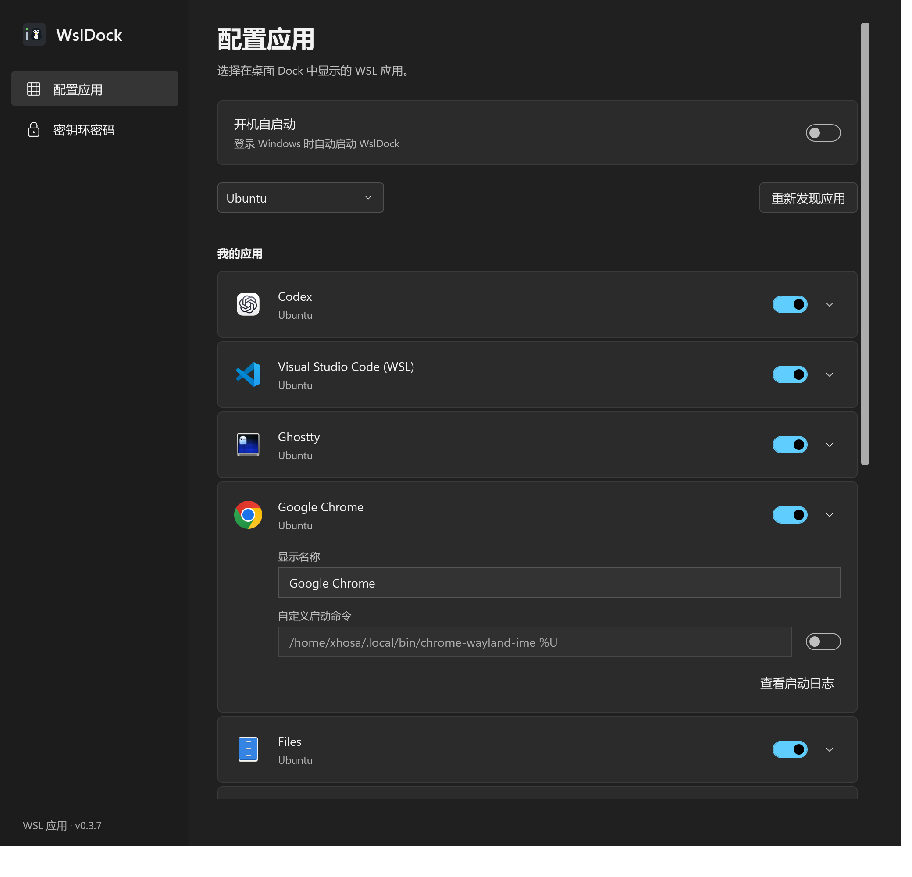
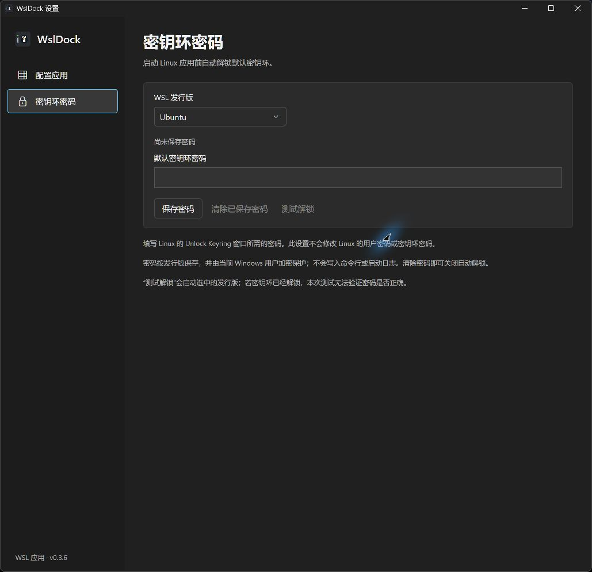

  
  <h1>WslDock</h1>
  
把常用 WSL 图形应用放到 Windows 桌面上

  
<a href="https://github.com/XhosaS/WslDock/releases/latest">下载已发布版本</a> · <a href="https://github.com/XhosaS/WslDock/issues">反馈问题</a>

WslDock 是面向 **Windows 11 x64 + WSLg** 的桌面应用启动器。点击图标即可启动或恢复 Linux 图形应用，支持应用发现、运行状态、密钥环自动解锁和登录自启。

## 下载与安装

最新版本：**v0.3.7**。从 [GitHub Release](https://github.com/XhosaS/WslDock/releases/tag/v0.3.7) 下载 `WslDock-Setup-v0.3.7.exe` 安装包或 `WslDock-0.3.7-win-x64.zip` 免安装包。

安装器安装到当前用户目录，创建开始菜单入口，可选桌面快捷方式，无需管理员权限。免安装版需解压整个文件夹，不能只移动 EXE。两个包均包含 .NET 运行时，无需另装 .NET。

系统要求：Windows 11 x64、启用 WSLg 的 WSL 2 发行版，以及发行版内的 Python 3。Linux 图形应用应已安装，并提供 `.desktop` 启动入口。

安装版更新：先从托盘菜单选择“退出 WslDock”，再运行新版安装器并安装到原目录。无需卸载；应用选择、位置、启动命令和已保存密码会保留。旧版的显示设置字段会在新版保存配置时清理。

## 界面预览

配置应用：选择发行版、发现应用、控制图标显示和登录自启。

密钥环密码：按发行版保存、清除和测试密码。

## 使用方法

1. 启动 WslDock。首次运行会发现首个 WSL 发行版的应用，默认显示识别到的 Codex、Chrome 和 Alacritty。
2. 点击 Dock 齿轮进入“配置应用”，选择发行版并点击“重新发现应用”，开启希望显示的应用。重新发现会同步桌面启动器的最新配置，保留 Dock 显示选择。显示名称始终可编辑并自动保存，重新发现不会覆盖手动修改的名称。展开应用的“启动配置”，打开“自定义启动命令”右侧的开关后可编辑命令，更改自动保存；重新发现会跳过该应用。关闭开关后，下次重新发现恢复同步。
3. 左键点击应用图标启动应用；已有窗口时恢复并尝试聚焦。图标下方圆点表示存在窗口或由 WslDock 启动的进程。
4. 拖动左侧短竖条调整 Dock 位置；竖条上方的小点表示是否有 WSL 发行版正在运行。
5. 如需自动解锁，进入“密钥环密码”，选择发行版，填写 Linux 的 Unlock Keyring 窗口所需密码并保存。

Dock 位于 Windows 桌面层，普通窗口可以遮住它，不占任务栏或 Alt+Tab。界面外观自动跟随 Windows 主题。设置保留“配置应用”和“密钥环密码”两个页面。

右键左侧拖动条或系统托盘图标可以打开菜单，双击托盘图标可重新显示 Dock。“关闭 WSL”在确认后执行 `wsl --shutdown`，停止所有发行版与 Linux 应用；请先保存工作。关闭后后台查询暂停，点击应用图标可重新启动。

重复启动会复用已有实例；设置窗口也只保留一份。关闭设置窗口后 Dock 继续运行。退出 WslDock 或隐藏应用图标不会关闭 Linux 应用。

## 密钥环与应用启动

- 密码由 Windows 当前用户加密保护，不写入命令行或启动日志。自动解锁支持默认 GNOME 密钥环，包括 Default Keyring；要求发行版提供 GNOME Keyring、GIO 和会话 D-Bus。
- “测试解锁”会启动发行版；密钥环已解锁时无法验证密码是否正确。“清除已保存密码”可关闭自动解锁。
- 应用使用配置的启动命令和原有包装器。WslDock 不注入缩放参数，不改写包装脚本，也不强制切换显示后端；已配置的 Wayland 参数会保留。
- 应用大小和清晰度由 WSLg 与应用自身处理，WslDock 不提供显示或缩放设置。启动命令中的参数仍由用户控制。

## 常见问题

**没有发现应用？** 确认发行版已安装 Python 3，应用有 `.desktop` 启动入口，然后选择正确的发行版重新发现。首次发现和启动应用可能唤起发行版，状态灯查询不会主动启动它。

**图标带企鹅角标？** Dock 通过 Linux 图标主题读取原始 PNG/SVG，不使用 Windows WSLg 图标缓存。旧缓存在发行版运行后自动更新，也可点击“重新发现应用”。SVG/主题解析使用发行版的 GTK 3 和 GdkPixbuf。

**应用只有图标，没有画面？** 展开应用的启动配置查看日志，并检查 WSLg 会话。WslDock 不会自动重启 WSL 或关闭 Linux 应用。

**如何卸载？** 安装版可从 Windows“设置 → 应用 → 已安装的应用”卸载。免安装版先关闭自启、退出 WslDock，再删除解压目录。卸载会保留用户配置；完全重置需在退出后删除 `%LOCALAPPDATA%\WslDock`。

设置保存在 `%LOCALAPPDATA%\WslDock\settings.json`，Windows 日志在同目录 `wsldock.log`，Linux 启动日志在 `~/.local/state/wsldock/`。

更多信息：[更新记录](CHANGELOG.md) · [开发指南](AGENTS.md)。
