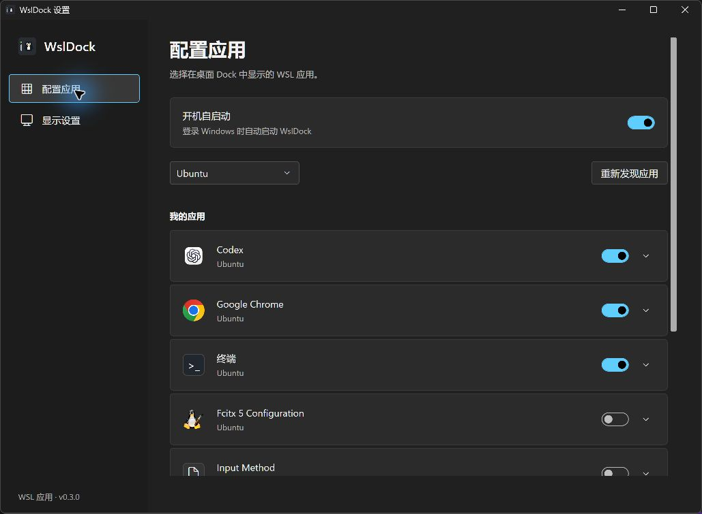
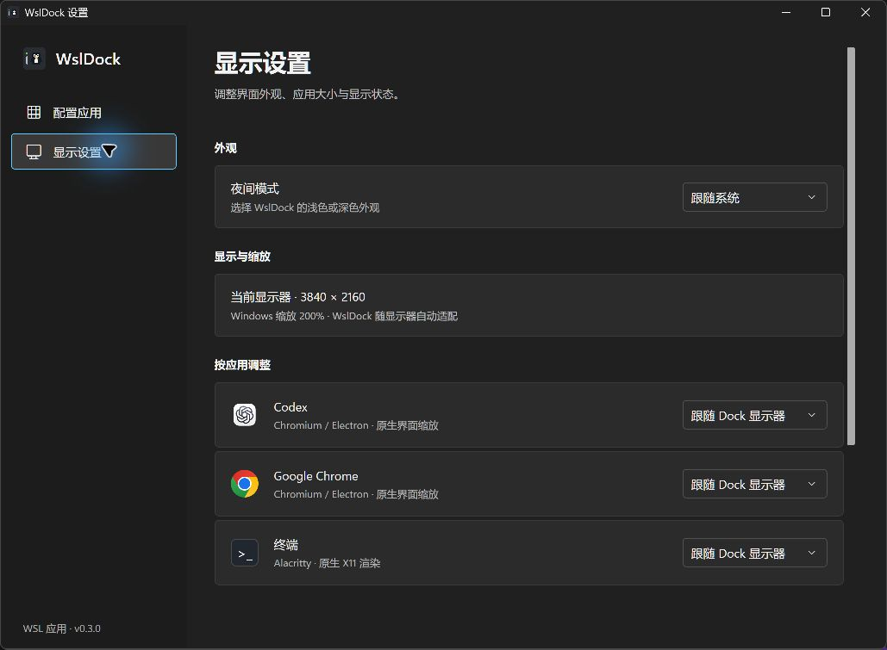

  
  <h1>WslDock</h1>
  
把常用 WSL 图形应用放到 Windows 桌面上

  
<a href="https://github.com/XhosaS/WslDock/releases/latest">下载最新版</a> · <a href="https://github.com/XhosaS/WslDock/issues">反馈问题</a>

WslDock 是面向 **Windows 11 x64 + WSLg** 的桌面应用启动器。点击图标即可启动或恢复 Linux 图形应用，支持应用发现、运行状态、逐应用缩放、深浅主题和登录自启。

## 下载与安装

当前版本：**v0.3.0**。

| 下载 | 使用方式 |
| --- | --- |
| [WslDock-Setup-v0.3.0.exe](https://github.com/XhosaS/WslDock/releases/download/v0.3.0/WslDock-Setup-v0.3.0.exe) | 推荐。安装到当前用户目录，创建开始菜单入口，可选桌面快捷方式；无需管理员权限。 |
| [WslDock-0.3.0-win-x64.zip](https://github.com/XhosaS/WslDock/releases/download/v0.3.0/WslDock-0.3.0-win-x64.zip) | 解压整个文件夹，双击 `WslDock.exe` 即可使用。请勿只移动 EXE。 |

两个包均包含 .NET 运行时，无需另装 .NET。Release 中的 Source code ZIP / TAR.GZ 是源码，供开发者使用。当前安装包尚未进行代码签名。

系统要求：Windows 11 x64、启用 WSLg 的 WSL 2 发行版，以及发行版内的 Python 3。需要启动的 Linux 图形应用应已安装，并提供 `.desktop` 入口。

## 界面预览

以下是 v0.3.0 实际运行截图，通过 Computer Use 截取。

**配置应用**：选择发行版、发现应用、控制图标显示和登录自启。

**显示设置**：选择主题，为支持的应用设置独立缩放比例。

## 使用方法

1. 启动 WslDock。首次运行会发现首个 WSL 发行版的应用，默认显示识别到的 Codex、Chrome 和 Alacritty。
2. 点击 Dock 齿轮进入“配置应用”，选择发行版并点击“重新发现应用”，开启希望显示的应用。
3. 左键点击应用图标启动应用；已有窗口时恢复并尝试聚焦。图标下方圆点表示存在窗口或由 WslDock 启动的进程。
4. 拖动左侧短竖条调整 Dock 位置；竖条上方的小点表示是否有 WSL 发行版正在运行。
5. 在“显示设置”选择跟随系统、浅色或深色主题，并调整应用缩放。

Dock 位于 **Windows 桌面层**，普通窗口可以遮住它，不占任务栏或 Alt+Tab；回到桌面即可使用。右键左侧拖动条或系统托盘图标可以打开菜单，双击托盘图标可重新显示 Dock。

重复启动会复用已有实例；设置窗口也只保留一份。关闭设置窗口后 Dock 继续运行，退出请使用托盘或拖动条菜单中的“退出 WslDock”。隐藏图标或退出 WslDock 都不会关闭 Linux 应用。

## 缩放与自启动

- Chrome / Chromium、已识别的 Codex Electron 入口和 Alacritty 支持跟随 Dock 所在显示器，或固定 100%–300% 缩放。其他应用保留自身设置。
- 比例在启动时生效。修改后先保存工作并完整退出目标应用，再从 Dock 启动；现有后台进程可能继续使用旧比例。
- 缩放不会修改 Ubuntu 或 WSLg 的全局设置，也不会在跨屏移动时自动重启应用。
- “配置应用”顶部可开启登录自启，默认关闭。移动免安装版目录后，请重新关闭再开启此选项以更新路径。

## 常见问题

**没有发现应用？** 确认发行版已安装 Python 3，应用有 `.desktop` 启动入口，然后选择正确的发行版重新发现。首次发现和启动应用可能唤起发行版，状态灯查询不会主动启动它。

**应用只有图标，没有画面？** 查看“显示设置”中的 WSLg 状态，以及应用启动配置中的日志。WslDock 能识别部分已知显示故障，但不能保证检测到所有问题；更新 WSL 前请保存 Linux 应用中的工作。

**如何卸载？** 安装版可从 Windows“设置 → 应用 → 已安装的应用”卸载。免安装版先关闭自启、退出 WslDock，再删除解压目录。卸载会保留用户配置；如需完全重置，可在退出后删除 `%LOCALAPPDATA%\WslDock`。

设置保存在 `%LOCALAPPDATA%\WslDock\settings.json`，Windows 日志在同目录 `wsldock.log`，Linux 启动日志在 `~/.local/state/wsldock/`。反馈问题前请检查日志中的本地路径和窗口标题。

更多信息：[更新记录](CHANGELOG.md) · [开发指南](AGENTS.md)。
